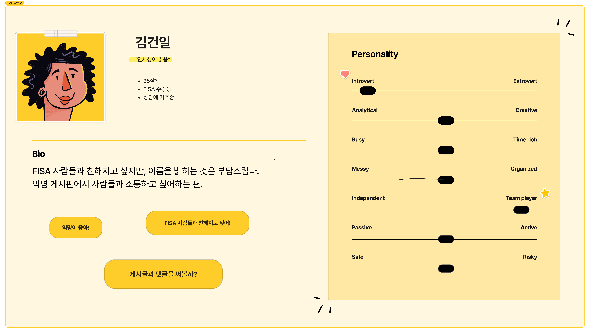
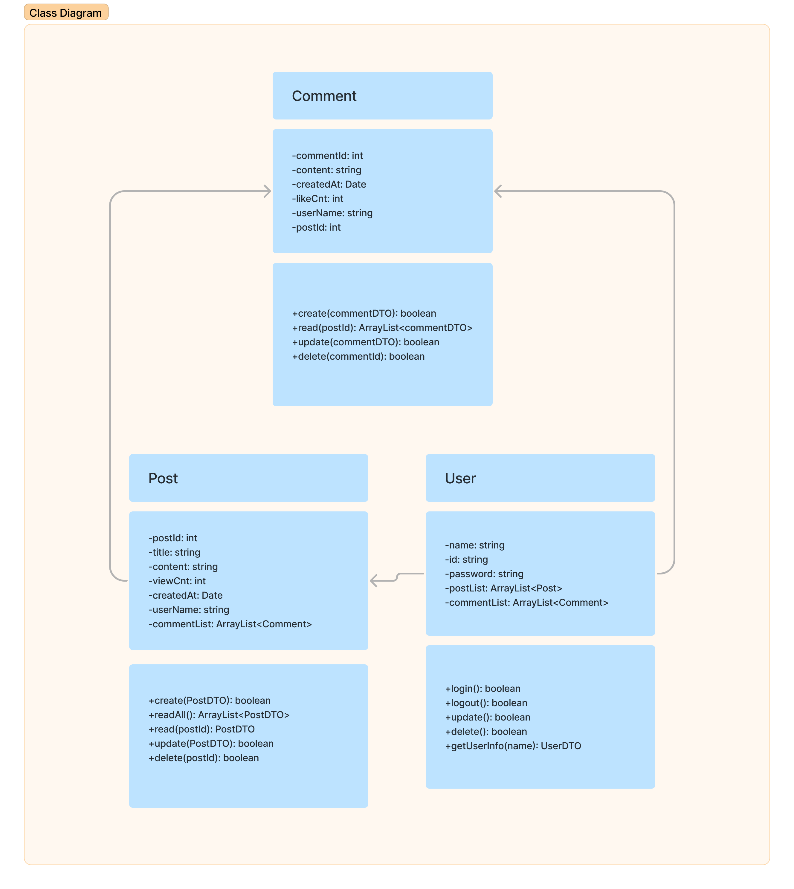
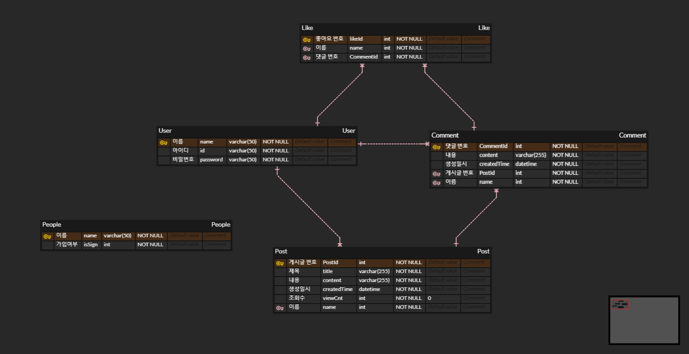
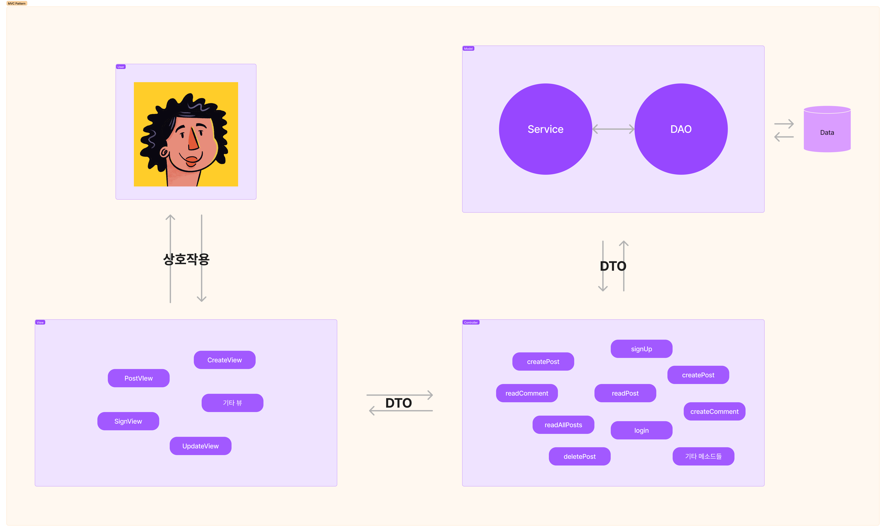

# 클숲

## 소개

### `클라우드 엔지니어링` 대나무 숲

`클라우드 엔지니어링` 학생들이 사용할 수 있는 자유 게시판을 구현합니다.

게시판 기능을 구현하기 위해 Java와 MySQL을 사용합니다.

강의 중에 배운 MVC, DTO, DAO, Builder 패턴을 활용합니다.

개발을 처음 접한 3명의 팀원이 각각 한 가지 주요 기능을 맡아서 개발합니다.

## 프로젝트 기간

_2023-05-08 ~ 2023-05-09_

## 멤버

김건영

김혁준

박정현

이연주

황태희

## 내용

### User Persona



### 설계

1. **Class Diagram**

서비스에 필요한 `Comment`, `Post`, `User` 클래스의 메소드와 변수를 설계하였습니다.



1. **ERD**

`Foreign key`로 이어진 테이블 간의 참조 관계를 이해하는데 도움이 됩니다.

N:M 관계에 있는 `Like` 테이블로 좋아요 기능을 구현하였습니다.



1. **Model, View, Controller 관계도**



### **_DDL_**

```sql
CREATE TABLE `user` (
	`name`	varchar(50)	NOT NULL,
	`id`	varchar(50)	NOT NULL,
	`password`	varchar(50)	NOT null,
	nickname varchar(50) not null,
	primary key(name)
);

CREATE TABLE `post` (
	`postId`	int auto_increment,
	`userName`	varchar(50)	NOT NULL,
	`title`	varchar(255)	NOT NULL,
	`content`	varchar(255)	NOT NULL,
	`createdTime`	datetime	NOT NULL,
	`viewCnt`	int	NOT NULL	DEFAULT 0,
	primary key(postId),
	foreign key(userName) references user(name) on delete cascade
);

CREATE TABLE `comment` (
	`commentId`	int	auto_increment,
	`userName`	varchar(50)	NOT NULL,
	`postId`	int	NOT NULL,
	`content`	varchar(255)	NOT NULL,
	`createdTime`	datetime	NOT null,
	primary key(commentId),
	foreign key(userName) references user(name) on delete cascade,
	foreign key(postId) references post(postId) on delete cascade
);

CREATE TABLE `like` (
	`likeId`	int auto_increment,
	`name`	varchar(50)	NOT NULL,
	`commentId`	int	NOT null,
	primary key(likeId),
	foreign key(name) references user(name) on delete cascade,
	foreign key(commentId) references comment(commentId) on delete cascade
);

CREATE TABLE `people` (
	`name`	varchar(50)	NOT NULL,
	`isSign`	int	NOT null
);
```
